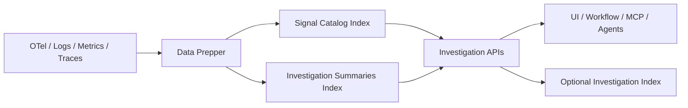

# RFC: OpenSearch Agent Observability Investigation Framework

## Status

Draft

## Abstract

OpenSearch already has logs, metrics, traces, PPL, Data Prepper, notebooks, alerting, and MCP-facing tool integration. What it lacks is not another point capability, but an investigation layer that can be reused across UI, workflows, and agents.

This RFC proposes an investigation API surface for OpenSearch. The API lets a caller:

1. discover what signals exist for an investigation target and where they live
2. narrow the search space using persisted summaries instead of broad raw scans
3. later pivot, compare, and continue an investigation without rebuilding context from scratch

To support those APIs, OpenSearch adds two new persistent structures:

1. `signal catalog`
2. `investigation summaries`

It also defines a minimal persisted investigation record, module boundaries, index mappings, ingestion flow, and dependency ordering.

This RFC does not redesign the observability UI, redefine OpenTelemetry base fields, or standardize cross-vendor workflow semantics.

---

## 1. Problem Statement

Modern observability systems are still organized around dashboards, trace views, log search, metric charts, and alerts. That works for interactive analysis, but it does not make investigation itself a reusable system capability.

This gap is becoming more visible because:

1. teams operate across too many tools and data sources
2. broad retrieval is increasingly expensive
3. both humans and agents need reusable intermediate state, not just raw hits and charts

The core problem is:

**OpenSearch exposes strong observability capabilities, but it does not yet expose investigation-ready APIs and system objects for discovery, early narrowing, and continued investigation.**

---

## 2. Existing OpenSearch Baseline

OpenSearch already provides most of the substrate needed here:

1. OTel-aligned ingestion through Collector -> Data Prepper -> OpenSearch
2. observability features across logs, traces, metrics, event analytics, and notebooks
3. PPL and Query DSL
4. alerting and anomaly-oriented features as investigation entry points
5. MCP-facing tools and agent integration in the ML plugin

The missing pieces are:

1. a stable API for investigation-oriented discovery and narrowing
2. a reusable discovery object that tells the system what signals exist for a target and where to read them
3. persisted summary objects that make narrowing cheap

This RFC builds those pieces on top of existing OpenSearch and OTel capabilities rather than replacing them.

---

## 3. API Overview

### 3.1 What This RFC Proposes

This RFC adds one investigation API surface to OpenSearch.

That API surface uses one shared target model and one shared set of backing objects.

The core operations are:

1. `discover`
2. `narrow`

The extended operations are:

1. `pivot`
2. `compare`
3. `continue`

### 3.2 Who Uses the Investigation API

The investigation API surface is used by:

1. UI or workflow services
2. MCP tools and agent integrations
3. automation or orchestration services that need a stable investigation contract

It is not used by raw telemetry producers. It sits between investigation consumers and the underlying observability indexes.

### 3.3 What the Core Operations Do

The API surface has five operations:

1. `discover` tells the caller what signals exist for a target, where they live, and what summaries are available
2. `narrow` tells the caller which candidates look most suspicious for that target and time range, using persisted summaries instead of broad raw scans
3. `pivot` moves the caller to another signal type without losing target and time context
4. `compare` measures difference or overlap between two scopes
5. `continue` resumes from a persisted investigation handle

### 3.4 End-to-End Mental Model

A typical call sequence is:

1. caller selects an investigation target
2. caller invokes `discover`
3. caller invokes `narrow`
4. caller optionally invokes `pivot` or `compare`
5. caller optionally persists and resumes with `continue`

The rest of this RFC explains the structures and execution path behind those calls.

---

## 4. Investigation API Contract

All APIs are served under `/_plugins/_investigation`.

### 4.1 Shared Request Fields

All operations use the same top-level request fields:

```json
{
  "object": {
    "type": "service",
    "id": "checkout-service",
    "attributes": {
      "environment": "prod"
    }
  },
  "time_range": {
    "from": "2026-04-01T00:00:00Z",
    "to": "2026-04-01T01:00:00Z"
  }
}
```

Shared meaning:

1. `object` identifies the investigation target
2. `time_range` bounds the investigation window

Each operation below adds its own request fields and response fields.

### 4.2 `POST /_plugins/_investigation/discover`

#### Purpose

Find available signals, source locators, correlation keys, and available summaries for an investigation target.

#### Request

```json
{
  "object": {
    "type": "service",
    "id": "checkout-service",
    "attributes": {
      "environment": "prod"
    }
  },
  "time_range": {
    "from": "2026-04-01T00:00:00Z",
    "to": "2026-04-01T01:00:00Z"
  },
  "preferred_signals": ["trace", "log"]
}
```

#### Response

```json
{
  "object": {
    "type": "service",
    "id": "checkout-service"
  },
  "available_signals": [
    {
      "signal_type": "trace",
      "locator": {
        "index_pattern": "otel-v1-apm-span-*",
        "timestamp_field": "@timestamp"
      },
      "correlation_keys": ["trace.id", "service.name", "deployment.version"],
      "summaries": [
        { "summary_type": "kll_doubles", "field": "duration_ms", "window": "60s" },
        { "summary_type": "hll", "field": "trace_id", "window": "60s" }
      ],
      "freshness_status": "fresh"
    }
  ],
  "recommended_next_ops": ["narrow"]
}
```

#### Read Path

This API reads only the `signal catalog`. It does not scan raw signal indexes.

### 4.3 `POST /_plugins/_investigation/narrow`

#### Purpose

Use persisted summaries to reduce the search space before raw drill-down.

#### Request

```json
{
  "object": {
    "type": "service",
    "id": "checkout-service"
  },
  "signal_type": "trace",
  "time_range": {
    "from": "2026-04-01T00:00:00Z",
    "to": "2026-04-01T01:00:00Z"
  },
  "method": {
    "summary_type": "kll_doubles",
    "field": "duration_ms",
    "percentiles": [0.5, 0.95, 0.99]
  },
  "group_by": "host.name",
  "summary_filter": {
    "term": { "dimensions.status.code": "ERROR" }
  }
}
```

`summary_filter` may use only dimensions materialized into summary documents.

#### Response

```json
{
  "object": {
    "type": "service",
    "id": "checkout-service"
  },
  "results": [
    {
      "group_value": "host-17",
      "estimates": {
        "p50": 420.0,
        "p95": 1900.0,
        "p99": 4100.0
      },
      "quality": {
        "relative_error": 0.0133,
        "confidence": 0.95,
        "sample_count": 18422
      }
    }
  ],
  "recommended_next_ops": ["raw_query"]
}
```

#### Read Path

This API reads only `investigation summaries`. If no matching summary exists, it returns `404 summary_not_available`.

### 4.4 `POST /_plugins/_investigation/pivot`

#### Purpose

Move from one signal type to another while preserving target and time context.

#### Request

```json
{
  "object": {
    "type": "service",
    "id": "checkout-service"
  },
  "from_signal": "trace",
  "to_signal": "log",
  "time_range": {
    "from": "2026-04-01T00:00:00Z",
    "to": "2026-04-01T01:00:00Z"
  },
  "correlation_key": "trace.id",
  "where": {
    "term": { "status.code": "ERROR" }
  }
}
```

#### Response

```json
{
  "target_signal": "log",
  "locator": {
    "index_pattern": "logs-app-*",
    "timestamp_field": "@timestamp"
  },
  "translated_filter": {
    "bool": {
      "filter": [
        { "term": { "service.name": "checkout-service" } },
        { "range": { "@timestamp": { "gte": "2026-04-01T00:00:00Z", "lte": "2026-04-01T01:00:00Z" } } }
      ]
    }
  }
}
```

This operation requires cross-signal translation logic and set operations.

### 4.5 `POST /_plugins/_investigation/compare`

#### Purpose

Compare two scopes or two time windows using summary-backed set or distribution operations.

#### Request

```json
{
  "left": {
    "object": { "type": "service", "id": "checkout-service" },
    "time_range": { "from": "2026-04-01T00:00:00Z", "to": "2026-04-01T00:30:00Z" }
  },
  "right": {
    "object": { "type": "deployment", "id": "checkout-2026-04-01-01" },
    "time_range": { "from": "2026-04-01T00:30:00Z", "to": "2026-04-01T01:00:00Z" }
  },
  "method": {
    "summary_type": "theta",
    "field": "user_id"
  }
}
```

#### Response

```json
{
  "comparison": {
    "intersection_estimate": 11203,
    "left_only_estimate": 1644,
    "right_only_estimate": 503,
    "jaccard": 0.84
  },
  "quality": {
    "confidence": 0.95
  }
}
```

This operation requires set operations.

### 4.6 Investigation State APIs

#### `POST /_plugins/_investigation/investigations`

Create a persisted investigation handle.

```json
{
  "entry_type": "alert",
  "entry_ref": "monitor:latency-p99-high",
  "focus_object": {
    "type": "service",
    "id": "checkout-service"
  },
  "time_range": {
    "from": "2026-04-01T00:00:00Z",
    "to": "2026-04-01T01:00:00Z"
  }
}
```

#### `GET /_plugins/_investigation/investigations/{id}`

Load persisted context.

#### `POST /_plugins/_investigation/investigations/{id}/continue`

Resume from stored context.

```json
{
  "operation": "narrow",
  "params": {
    "signal_type": "trace",
    "method": {
      "summary_type": "kll_doubles",
      "field": "duration_ms",
      "percentiles": [0.95, 0.99]
    },
    "group_by": "host.name"
  }
}
```

---

## 5. Walkthrough

One intended flow is:

1. alert identifies a p99 latency spike on `checkout-service`
2. caller invokes `discover`
3. response shows trace and log locators plus KLL and HLL summaries
4. caller invokes `narrow` grouped by `host.name`
5. response identifies `host-17` and `host-23` as most suspicious
6. caller optionally pivots to logs or persists the investigation for later continuation

The caller interacts with the API first. Catalogs, summaries, and persisted state exist to support those calls.

---

## 6. Investigation Object Reference

Raw traces, logs, metrics, and events continue to use existing OTel and OpenSearch field schemas.

The investigation API uses one compact target reference:

```json
{
  "type": "service",
  "id": "checkout-service",
  "attributes": {
    "namespace": "prod",
    "environment": "prod",
    "version": "2025.01.15",
    "cluster": "payments-us-west-2"
  }
}
```

### 6.1 Supported Object Types

1. `service`
2. `deployment`
3. `host`
4. `tenant`
5. `endpoint`
6. `trace`

### 6.2 Required Reference Terms

1. `object.type`: logical identity class
2. `object.id`: identifier extracted from existing OTel/OpenSearch fields for investigation use
3. `object.attributes`: additional selectors copied from existing fields and carried through investigation calls
4. `signal_type`: one of `trace`, `metric`, `log`, `event`
5. `time_range`: `{ "from": "...", "to": "..." }` in ISO-8601

---

## 7. Module Architecture and Relationships

### 7.1 Module Responsibilities

| Module | Responsibility | New in this RFC |
| --- | --- | --- |
| Ingestion | Convert normalized telemetry into reusable investigation inputs | yes |
| Storage | Persist catalog, summaries, and optional minimal investigation state | yes |
| Query/Execution | Serve the investigation API over catalog, summaries, and raw signals | yes |
| UI/Workflow/Agent Consumers | Call the same investigation APIs with different presentation layers | no new object model |
| Governance/Security | Apply index permissions, audit state changes, constrain automation use | minimal |

### 7.2 End-to-End Flow



### 7.3 Dependency Order

1. investigation object reference
2. ingestion processors
3. `signal catalog`
4. `investigation summaries`
5. `discover`
6. `narrow`
7. persisted investigation handle and `continue`
8. `pivot` and `compare`

---

## 8. Data Structures

### 8.1 `investigation-signal-catalog-v1`

One document represents one investigation target x one signal type x one source locator.

#### Mapping

```json
{
  "mappings": {
    "properties": {
      "object": {
        "properties": {
          "type": { "type": "keyword" },
          "id": { "type": "keyword" },
          "attributes": { "type": "flattened" }
        }
      },
      "signal_type": { "type": "keyword" },
      "locator": {
        "properties": {
          "index_pattern": { "type": "keyword" },
          "timestamp_field": { "type": "keyword" },
          "query_filter": { "type": "object", "enabled": false }
        }
      },
      "time_coverage": {
        "properties": {
          "start": { "type": "date" },
          "end": { "type": "date" }
        }
      },
      "correlation_keys": { "type": "keyword" },
      "resolution": { "type": "keyword" },
      "freshness": {
        "properties": {
          "last_seen_at": { "type": "date" },
          "stale_after_seconds": { "type": "integer" },
          "status": { "type": "keyword" }
        }
      },
      "summaries": {
        "type": "nested",
        "properties": {
          "summary_type": { "type": "keyword" },
          "index_pattern": { "type": "keyword" },
          "window": { "type": "keyword" },
          "fields": { "type": "keyword" }
        }
      },
      "pipeline": {
        "properties": {
          "pipeline_id": { "type": "keyword" },
          "source_type": { "type": "keyword" }
        }
      },
      "updated_at": { "type": "date" }
    }
  }
}
```

#### Example Document

```json
{
  "object": {
    "type": "service",
    "id": "checkout-service",
    "attributes": {
      "environment": "prod",
      "cluster": "payments-us-west-2"
    }
  },
  "signal_type": "trace",
  "locator": {
    "index_pattern": "otel-v1-apm-span-*",
    "timestamp_field": "@timestamp",
    "query_filter": {
      "term": { "service.name": "checkout-service" }
    }
  },
  "time_coverage": {
    "start": "2026-03-30T00:00:00Z",
    "end": "2026-04-01T00:00:00Z"
  },
  "correlation_keys": [
    "trace.id",
    "service.name",
    "deployment.version",
    "tenant.id"
  ],
  "resolution": "raw",
  "freshness": {
    "last_seen_at": "2026-04-01T00:00:15Z",
    "stale_after_seconds": 300,
    "status": "fresh"
  },
  "summaries": [
    {
      "summary_type": "kll_doubles",
      "index_pattern": "investigation-summaries-v1-*",
      "window": "60s",
      "fields": ["duration_ms"]
    },
    {
      "summary_type": "hll",
      "index_pattern": "investigation-summaries-v1-*",
      "window": "60s",
      "fields": ["trace_id"]
    }
  ],
  "pipeline": {
    "pipeline_id": "trace-investigation-pipeline",
    "source_type": "otel_trace_source"
  },
  "updated_at": "2026-04-01T00:00:15Z"
}
```

### 8.2 `investigation-summaries-v1`

One document represents one investigation target x one signal type x one summary type x one time window.

#### Mapping

```json
{
  "mappings": {
    "properties": {
      "object": {
        "properties": {
          "type": { "type": "keyword" },
          "id": { "type": "keyword" },
          "attributes": { "type": "flattened" }
        }
      },
      "signal_type": { "type": "keyword" },
      "field": { "type": "keyword" },
      "group_by": { "type": "keyword" },
      "group_value": { "type": "keyword" },
      "dimensions": { "type": "flattened" },
      "window": {
        "properties": {
          "start": { "type": "date" },
          "end": { "type": "date" },
          "duration": { "type": "keyword" }
        }
      },
      "summary_type": { "type": "keyword" },
      "payload": { "type": "binary", "doc_values": true },
      "parameters": {
        "properties": {
          "k": { "type": "integer" },
          "lgk": { "type": "integer" },
          "nominal_entries": { "type": "integer" }
        }
      },
      "quality": {
        "properties": {
          "sample_count": { "type": "long" },
          "relative_error": { "type": "double" },
          "confidence": { "type": "double" }
        }
      },
      "provenance": {
        "properties": {
          "pipeline_id": { "type": "keyword" },
          "source_index_pattern": { "type": "keyword" },
          "source_query_hash": { "type": "keyword" }
        }
      },
      "created_at": { "type": "date" }
    }
  }
}
```

#### Initial Summary Types

1. `histogram`
2. `derived_metric`
3. `hll`
4. `kll_doubles`

#### Later Summary Types

1. `theta`
2. `frequent_items`

#### Example Document

```json
{
  "object": {
    "type": "service",
    "id": "checkout-service",
    "attributes": {
      "environment": "prod"
    }
  },
  "signal_type": "trace",
  "field": "duration_ms",
  "group_by": "host.name",
  "group_value": "host-17",
  "dimensions": {
    "status.code": "ERROR",
    "deployment.version": "2026.04.01-1"
  },
  "window": {
    "start": "2026-04-01T00:00:00Z",
    "end": "2026-04-01T00:01:00Z",
    "duration": "60s"
  },
  "summary_type": "kll_doubles",
  "payload": "BASE64_BYTES",
  "parameters": {
    "k": 200
  },
  "quality": {
    "sample_count": 18422,
    "relative_error": 0.0133,
    "confidence": 0.95
  },
  "provenance": {
    "pipeline_id": "trace-investigation-pipeline",
    "source_index_pattern": "otel-v1-apm-span-*",
    "source_query_hash": "0fbc3e..."
  },
  "created_at": "2026-04-01T00:01:02Z"
}
```

### 8.3 `investigations-v1`

The API uses one small persisted investigation record:

#### Mapping

```json
{
  "mappings": {
    "properties": {
      "investigation_id": { "type": "keyword" },
      "entry_type": { "type": "keyword" },
      "entry_ref": { "type": "keyword" },
      "focus_object": {
        "properties": {
          "type": { "type": "keyword" },
          "id": { "type": "keyword" },
          "attributes": { "type": "flattened" }
        }
      },
      "time_range": {
        "properties": {
          "from": { "type": "date" },
          "to": { "type": "date" }
        }
      },
      "state": { "type": "keyword" },
      "suspects": {
        "type": "nested",
        "properties": {
          "kind": { "type": "keyword" },
          "value": { "type": "keyword" },
          "score": { "type": "double" }
        }
      },
      "history": {
        "type": "nested",
        "properties": {
          "at": { "type": "date" },
          "operation": { "type": "keyword" },
          "summary": { "type": "text" }
        }
      },
      "conclusion": {
        "properties": {
          "status": { "type": "keyword" },
          "confidence": { "type": "double" },
          "actionability": { "type": "keyword" },
          "summary": { "type": "text" }
        }
      },
      "updated_at": { "type": "date" }
    }
  }
}
```

#### State Machine

1. `open -> narrowed`
2. `narrowed -> suspected`
3. `narrowed -> inconclusive`
4. `suspected -> concluded`
5. `suspected -> inconclusive`
6. `inconclusive -> narrowed`
7. `concluded -> open` only through explicit `reopen`

#### Concurrency Model

Investigation updates use optimistic concurrency control. A stale update must return `409 Conflict`.

---

## 9. Ingestion Design

### 9.1 New Data Prepper Components

This RFC adds:

1. `investigation_catalog` processor
2. `sketch_aggregate` aggregate action

### 9.2 `investigation_catalog` Processor

#### Inputs

1. normalized event after OTel/resource parsing
2. investigation target extraction rules
3. signal type
4. index locator metadata

#### Behavior

1. derive an investigation object reference from existing OTel resource fields and configured fallbacks
2. upsert one catalog record per target x signal type x locator
3. update `time_coverage.end`, `freshness.last_seen_at`, and available summary references
4. mark records stale asynchronously when `last_seen_at + stale_after_seconds < now`

#### Failure Rule

If investigation target extraction fails, ingestion must continue. The processor increments a failure metric and skips the catalog write.

### 9.3 `sketch_aggregate` Aggregate Action

#### Inputs

1. `identification_keys`
2. `group_duration`
3. sketch config list

#### Supported Sketches

1. HLL for count-distinct and blast-radius estimation
2. KLL for percentile narrowing

#### Example Pipeline

```yaml
investigation-trace-pipeline:
  source:
    otel_trace_source:
      ssl: false
  processor:
    - investigation_catalog:
        object_type: service
        object_id_fields: ["service.name"]
        object_attribute_fields: ["deployment.environment", "service.version", "cloud.region"]
        signal_type: trace
        locator:
          index_pattern: "otel-v1-apm-span-*"
          timestamp_field: "@timestamp"
        correlation_keys: ["trace.id", "service.name", "deployment.version", "tenant.id"]
        stale_after_seconds: 300
    - sketch_aggregate:
        identification_keys: ["service.name", "host.name"]
        group_duration: "60s"
        sketches:
          - name: latency_kll
            type: kll_doubles
            k: 200
            source_field: duration_ms
          - name: trace_id_hll
            type: hll
            lgk: 12
            source_field: trace_id
  sink:
    - opensearch:
        index: "investigation-summaries-v1-%{yyyy.MM.dd}"
```

### 9.4 Entry Context Security Rule

If entry context is propagated through OTel baggage, it must carry only opaque investigation IDs or workflow IDs. Raw conclusions or trust-sensitive content must not be propagated in baggage.

---

## 10. PPL and Plugin Integration

### 10.1 Query Plugin

This RFC adds summary-aware query functions through the OpenSearch aggregation/plugin surface.

#### Core Functions

1. `sketch_count_distinct(field)`
2. `sketch_percentile(field, p)`
3. `sketch_merge(field)`
4. `sketch_estimate(sketch)`

#### Additional Functions

1. `sketch_diff(a, b)`
2. `sketch_intersect(a, b)`
3. `sketch_top_k(field, k)`

### 10.2 PPL Examples

#### Discover

```sql
source = investigation-summaries-v1-*
| where object.id = "checkout-service" and summary_type = "hll" and field = "trace_id"
| stats sketch_count_distinct(payload) as affected
```

#### Narrow

```sql
source = investigation-summaries-v1-*
| where object.id = "checkout-service" and summary_type = "kll_doubles" and field = "duration_ms"
| stats sketch_percentile(payload, 0.99) as p99 by group_value
| where p99 > 2000
| sort - p99
```

### 10.3 MCP and Agent Surface

OpenSearch already exposes MCP-facing tools. MCP wrappers should call the same REST APIs defined above. There is no separate agent-only model.

1. `investigation_discover`
2. `investigation_narrow`
3. `investigation_pivot`
4. `investigation_compare`
5. `investigation_continue`

---

## 11. Minimal Governance and Security

Governance stays minimal. The API and the persisted investigation record carry explicit fields for status, confidence, actionability, and audit history.

### 11.1 Required Fields

1. `conclusion.status`: `open`, `narrowed`, `suspected`, `inconclusive`, `concluded`
2. `conclusion.confidence`: `0.0-1.0`
3. `conclusion.actionability`: `analysis_only`, `human_review_required`, `automation_allowed`
4. summary `quality`: error/confidence metadata

### 11.2 Security Model

1. catalog and summary reads follow normal OpenSearch index permissions
2. investigation writes require explicit write access to `investigations-v1`
3. automation that consumes `automation_allowed` conclusions remains out of scope
4. baggage propagation must carry opaque IDs only

### 11.3 Audit Rule

Every update to an investigation document must append one `history` event containing:

1. timestamp
2. operation
3. human-readable summary

---

## 12. Failure Modes and Fallbacks

### 12.1 Stale Catalog

If `freshness.status = stale`, `discover` still returns the record and marks it stale.

### 12.2 Missing Summary

If no matching summary exists, `narrow` must fail explicitly with `summary_not_available`. Silent fallback to broad raw scans is prohibited in the API layer.

### 12.3 Sketch Quality Too Low

If summary error exceeds the configured threshold, the API returns `quality_warning = true`. The result may still be used for narrowing but not for automated action.

### 12.4 Parallel Investigation Updates

Concurrent updates to `investigations-v1` use optimistic concurrency. The caller must reload and retry on `409 Conflict`.

---

## 13. Alternatives Considered

### 13.1 Use Notebooks as the Investigation Container

Rejected. Notebooks are a presentation container, not a canonical discovery or summary object, and they do not provide a stable execution API.

### 13.2 Extend Application Analytics Only

Rejected. Application Analytics groups signals, which is useful, but it is not a persisted signal-discovery contract and does not define summary-backed narrowing APIs.

### 13.3 Use Alerting as the Full Investigation Engine

Rejected. Alerting is a valid entry point, but it does not answer what signal to inspect next or provide reusable narrowing summaries.

---

## 14. Non-Goals

This RFC does not:

1. redefine OTel base telemetry semantics
2. replace existing dashboards, notebooks, or trace analytics views
3. require all investigations to persist state
4. standardize cross-vendor workflow semantics
5. allow approximate summaries to directly trigger automated remediation

---

## 15. FAQ

### Q1. Is this only for agents?

No. The same API surface is useful for human-facing UI and workflows. Agents benefit more because they depend more directly on system objects than on page-level intuition.

### Q2. Why is `signal catalog` in OpenSearch core?

Because it is the system of record for where signals live and how they correlate. If it lives only in UI or workflow code, discovery cannot be reused.

### Q3. Why are sketches part of the RFC?

Because they are not just query acceleration. They are the persisted summary structure that makes early narrowing cheap and composable.

### Q4. Why is persisted investigation state minimal?

Because the core proposal is an investigation API backed by discovery and summary objects, not a full case-management system.

---

## References

[1]: https://docs.opensearch.org/latest/observing-your-data/?utm_source=chatgpt.com "Observability"
[2]: https://opentelemetry.io/docs/concepts/semantic-conventions/?utm_source=chatgpt.com "Semantic Conventions"
[3]: https://newrelic.com/sites/default/files/2024-10/new-relic-2024-observability-forecast-report.pdf?utm_source=chatgpt.com "2024 Observability Forecast Report"
[4]: https://grafana.com/observability-survey/2025/?utm_source=chatgpt.com "Observability Survey Report 2025 - key findings"
[5]: https://docs.datadoghq.com/bits_ai/bits_ai_sre/investigate_issues/?utm_source=chatgpt.com "Investigate Issues"
[6]: https://docs.opensearch.org/latest/data-prepper/common-use-cases/trace-analytics/?utm_source=chatgpt.com "Trace analytics"
[7]: https://opentelemetry.io/docs/concepts/resources/?utm_source=chatgpt.com "Resources"
[8]: https://docs.opensearch.org/latest/observing-your-data/trace/getting-started/?utm_source=chatgpt.com "Getting started with Trace Analytics"
[9]: https://docs.opensearch.org/latest/data-prepper/common-use-cases/metrics-traces/?utm_source=chatgpt.com "Deriving metrics from traces"
[10]: https://opentelemetry.io/docs/concepts/signals/baggage/?utm_source=chatgpt.com "Baggage"
[11]: https://docs.opensearch.org/latest/observing-your-data/event-analytics/?utm_source=chatgpt.com "Event analytics"
[12]: https://docs.opensearch.org/latest/ml-commons-plugin/agents-tools/mcp/index/?utm_source=chatgpt.com "Using MCP tools"
