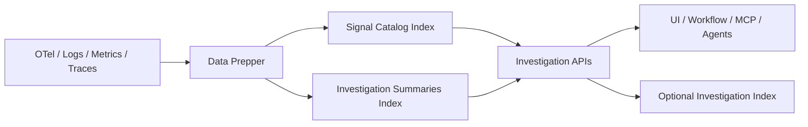

# RFC：OpenSearch Agent 可观测性调查框架

## 状态

Draft

## 摘要

OpenSearch 已经具备 logs、metrics、traces、PPL、Data Prepper、notebooks、alerting，以及面向 MCP 的工具集成。缺失的不是另一个点状能力，而是一层可以在 UI、workflow 和 agents 之间复用的 investigation layer。

本 RFC 提议在 OpenSearch 中提供一组 investigation API。通过这组 API，调用方可以：

1. discover 某个调查目标有哪些信号、它们在哪里
2. 使用持久化 summaries 做 narrow，而不是直接做大范围 raw scans
3. 在后续需要时进行 pivot、compare，或者 continue 一个已存在的 investigation

为了支撑这些 API，OpenSearch 需要增加两个新的持久化结构：

1. `signal catalog`
2. `investigation summaries`

同时，RFC 还定义一个最小化的 persisted investigation record、模块边界、index mappings、ingestion 流程，以及依赖顺序。

本 RFC 不涉及 observability UI 重设计，不重新定义 OpenTelemetry 基础字段，也不尝试标准化跨厂商 workflow semantics。

---

## 1. 问题陈述

现代可观测性系统仍然主要围绕 dashboards、trace views、日志搜索、指标图表和 alerts 来组织。这种方式适合交互式分析，但并没有把 investigation 本身建模成一个可复用的系统能力。

这个缺口越来越明显，原因主要有三点：

1. 团队运行在过多的工具和数据源之上
2. 大范围检索越来越昂贵
3. 无论是人还是 agent，都需要可复用的中间状态，而不只是 raw hits 和 charts

核心问题是：

**OpenSearch 已经具备很强的 observability capabilities，但它还没有暴露面向 investigation 的 APIs 和系统对象，无法支撑 discovery、early narrowing 和 continued investigation。**

---

## 2. OpenSearch 现有基础

OpenSearch 已经提供了这个方向所需的大部分底层基础：

1. 通过 Collector -> Data Prepper -> OpenSearch 的 OTel 对齐 ingestion
2. 面向 logs、traces、metrics、event analytics 和 notebooks 的 observability features
3. PPL 和 Query DSL
4. 作为 investigation entry point 的 alerting 和 anomaly-oriented features
5. ML plugin 中面向 MCP 的工具和 agent integration

缺失的部分是：

1. 一个稳定的 investigation-oriented API surface，用于 discovery 和 narrowing
2. 一个可复用的 discovery object，用于告诉系统某个 target 有哪些 signals、它们在哪里
3. 一组持久化 summary objects，用于把 narrowing 变得低成本

本 RFC 是在现有 OpenSearch 和 OTel 能力之上补齐这些部分，而不是替换它们。

---

## 3. API 概览

### 3.1 这个 RFC 到底 propose 什么

本 RFC 给 OpenSearch 增加一个 investigation API surface。

这不是几组彼此无关的 API，而是一组建立在同一个 target model 和同一组 backing objects 之上的 investigation operations。

核心 operations 是：

1. `discover`
2. `narrow`

扩展 operations 是：

1. `pivot`
2. `compare`
3. `continue`

### 3.2 谁会使用 Investigation API

这个 investigation API surface 主要给以下调用方使用：

1. UI 或 workflow services
2. MCP tools 和 agent integrations
3. 需要稳定 investigation contract 的 automation 或 orchestration services

它不是给 raw telemetry producers 用的。它位于 investigation consumers 和底层 observability indexes 之间。

### 3.3 核心 operations 到底做什么

这个 API surface 包含五个 operations：

1. `discover` 告诉调用方：某个 target 有哪些 signals、它们在哪里、有哪些 summaries 可用
2. `narrow` 告诉调用方：对这个 target 和时间范围，基于 persisted summaries，哪些 candidates 最可疑，从而避免直接做大范围 raw scans
3. `pivot` 让调用方切到另一种 signal type，同时不丢失 target 和 time context
4. `compare` 用来衡量两个 scopes 之间的差异或重叠
5. `continue` 用来从一个 persisted investigation handle 中恢复

### 3.4 端到端心智模型

一个典型的调用顺序是：

1. 调用方先选择一个 investigation target
2. 调用 `discover`
3. 调用 `narrow`
4. 在需要时调用 `pivot` 或 `compare`
5. 在需要时持久化 investigation，并通过 `continue` 恢复

后面的所有设计，都是在解释这些调用背后的结构和执行路径。

---

## 4. Investigation API Contract

所有 API 都挂在 `/_plugins/_investigation` 之下。

### 4.1 共享请求字段

所有操作都使用同一组顶层请求字段：

```json
{
  "object": {
    "type": "service",
    "id": "checkout-service",
    "attributes": {
      "environment": "prod"
    }
  },
  "time_range": {
    "from": "2026-04-01T00:00:00Z",
    "to": "2026-04-01T01:00:00Z"
  }
}
```

这些字段的含义很直接：

1. `object` 用来标识 investigation target
2. `time_range` 用来限定 investigation window

每个 operation 都会在这个基础上增加自己的请求字段和响应字段。

### 4.2 `POST /_plugins/_investigation/discover`

#### 目的

查找某个 investigation target 对应的 available signals、source locators、correlation keys，以及可用 summaries。

#### 请求

```json
{
  "object": {
    "type": "service",
    "id": "checkout-service",
    "attributes": {
      "environment": "prod"
    }
  },
  "time_range": {
    "from": "2026-04-01T00:00:00Z",
    "to": "2026-04-01T01:00:00Z"
  },
  "preferred_signals": ["trace", "log"]
}
```

#### 响应

```json
{
  "object": {
    "type": "service",
    "id": "checkout-service"
  },
  "available_signals": [
    {
      "signal_type": "trace",
      "locator": {
        "index_pattern": "otel-v1-apm-span-*",
        "timestamp_field": "@timestamp"
      },
      "correlation_keys": ["trace.id", "service.name", "deployment.version"],
      "summaries": [
        { "summary_type": "kll_doubles", "field": "duration_ms", "window": "60s" },
        { "summary_type": "hll", "field": "trace_id", "window": "60s" }
      ],
      "freshness_status": "fresh"
    }
  ],
  "recommended_next_ops": ["narrow"]
}
```

#### 读取路径

这个 API 只读取 `signal catalog`，不会去扫描 raw signal indexes。

### 4.3 `POST /_plugins/_investigation/narrow`

#### 目的

在进入 raw drill-down 之前，先用 persisted summaries 缩小搜索空间。

#### 请求

```json
{
  "object": {
    "type": "service",
    "id": "checkout-service"
  },
  "signal_type": "trace",
  "time_range": {
    "from": "2026-04-01T00:00:00Z",
    "to": "2026-04-01T01:00:00Z"
  },
  "method": {
    "summary_type": "kll_doubles",
    "field": "duration_ms",
    "percentiles": [0.5, 0.95, 0.99]
  },
  "group_by": "host.name",
  "summary_filter": {
    "term": { "dimensions.status.code": "ERROR" }
  }
}
```

`summary_filter` 只能使用已经物化进 summary documents 的维度。

#### 响应

```json
{
  "object": {
    "type": "service",
    "id": "checkout-service"
  },
  "results": [
    {
      "group_value": "host-17",
      "estimates": {
        "p50": 420.0,
        "p95": 1900.0,
        "p99": 4100.0
      },
      "quality": {
        "relative_error": 0.0133,
        "confidence": 0.95,
        "sample_count": 18422
      }
    }
  ],
  "recommended_next_ops": ["raw_query"]
}
```

#### 读取路径

这个 API 只读取 `investigation summaries`。如果没有匹配的 summary，就返回 `404 summary_not_available`。

### 4.4 `POST /_plugins/_investigation/pivot`

#### 目的

在不同 signal types 之间切换，同时保留 target 和 time context。

#### 请求

```json
{
  "object": {
    "type": "service",
    "id": "checkout-service"
  },
  "from_signal": "trace",
  "to_signal": "log",
  "time_range": {
    "from": "2026-04-01T00:00:00Z",
    "to": "2026-04-01T01:00:00Z"
  },
  "correlation_key": "trace.id",
  "where": {
    "term": { "status.code": "ERROR" }
  }
}
```

#### 响应

```json
{
  "target_signal": "log",
  "locator": {
    "index_pattern": "logs-app-*",
    "timestamp_field": "@timestamp"
  },
  "translated_filter": {
    "bool": {
      "filter": [
        { "term": { "service.name": "checkout-service" } },
        { "range": { "@timestamp": { "gte": "2026-04-01T00:00:00Z", "lte": "2026-04-01T01:00:00Z" } } }
      ]
    }
  }
}
```

这个操作需要 cross-signal translation logic 和 set operations。

### 4.5 `POST /_plugins/_investigation/compare`

#### 目的

使用 summary-backed 的集合或分布操作，对两个 scope 或两个时间窗进行比较。

#### 请求

```json
{
  "left": {
    "object": { "type": "service", "id": "checkout-service" },
    "time_range": { "from": "2026-04-01T00:00:00Z", "to": "2026-04-01T00:30:00Z" }
  },
  "right": {
    "object": { "type": "deployment", "id": "checkout-2026-04-01-01" },
    "time_range": { "from": "2026-04-01T00:30:00Z", "to": "2026-04-01T01:00:00Z" }
  },
  "method": {
    "summary_type": "theta",
    "field": "user_id"
  }
}
```

#### 响应

```json
{
  "comparison": {
    "intersection_estimate": 11203,
    "left_only_estimate": 1644,
    "right_only_estimate": 503,
    "jaccard": 0.84
  },
  "quality": {
    "confidence": 0.95
  }
}
```

这个操作需要 set operations。

### 4.6 Investigation State APIs

#### `POST /_plugins/_investigation/investigations`

创建一个 persisted investigation handle。

```json
{
  "entry_type": "alert",
  "entry_ref": "monitor:latency-p99-high",
  "focus_object": {
    "type": "service",
    "id": "checkout-service"
  },
  "time_range": {
    "from": "2026-04-01T00:00:00Z",
    "to": "2026-04-01T01:00:00Z"
  }
}
```

#### `GET /_plugins/_investigation/investigations/{id}`

读取持久化上下文。

#### `POST /_plugins/_investigation/investigations/{id}/continue`

从已保存上下文中恢复。

```json
{
  "operation": "narrow",
  "params": {
    "signal_type": "trace",
    "method": {
      "summary_type": "kll_doubles",
      "field": "duration_ms",
      "percentiles": [0.95, 0.99]
    },
    "group_by": "host.name"
  }
}
```

---

## 5. Walkthrough

一个典型流程是：

1. alert 先发现 `checkout-service` 的 p99 latency spike
2. 调用方先调用 `discover`
3. 响应返回 trace 和 log 的 locators，以及 KLL 和 HLL summaries
4. 调用方再调用 `narrow`，按 `host.name` 分组
5. 响应指出 `host-17` 和 `host-23` 最可疑
6. 调用方可以继续 pivot 到 logs，或者持久化当前 investigation，稍后通过 `continue` 恢复

调用方首先面对的是 API。catalog、summaries 和 persisted state 的存在，都是为了支撑这些调用。

---

## 6. Investigation Object Reference

对于 raw traces、logs、metrics 和 events，OpenSearch 继续使用现有的 OTel 和 OpenSearch 字段 schema。

Investigation API 只需要一个紧凑的 target reference：

```json
{
  "type": "service",
  "id": "checkout-service",
  "attributes": {
    "namespace": "prod",
    "environment": "prod",
    "version": "2025.01.15",
    "cluster": "payments-us-west-2"
  }
}
```

### 6.1 支持的 Object Types

1. `service`
2. `deployment`
3. `host`
4. `tenant`
5. `endpoint`
6. `trace`

### 6.2 必需的 Reference Terms

1. `object.type`：逻辑身份类别
2. `object.id`：从现有 OTel/OpenSearch 字段中提取、供 investigation 使用的标识符
3. `object.attributes`：从现有字段复制出来，并在 investigation calls 中向后传递的附加 selectors
4. `signal_type`：`trace`、`metric`、`log`、`event` 之一
5. `time_range`：ISO-8601 格式的 `{ "from": "...", "to": "..." }`

---

## 7. 模块架构与关系

### 7.1 模块职责

| 模块 | 职责 | 本 RFC 中是否新增 |
| --- | --- | --- |
| Ingestion | 把规范化后的 telemetry 转换为可复用的 investigation inputs | 是 |
| Storage | 持久化 catalog、summaries 和可选的最小 investigation state | 是 |
| Query/Execution | 基于 catalog、summaries 和 raw signals 对外提供 investigation API | 是 |
| UI/Workflow/Agent Consumers | 调用同一套 investigation APIs，只在展示层不同 | 不新增 object model |
| Governance/Security | 应用 index permissions、审计状态变更、约束 automation usage | 最小化 |

### 7.2 端到端流程



### 7.3 依赖顺序

1. investigation object reference
2. ingestion processors
3. `signal catalog`
4. `investigation summaries`
5. `discover`
6. `narrow`
7. persisted investigation handle 和 `continue`
8. `pivot` 和 `compare`

---

## 8. 数据结构

### 8.1 `investigation-signal-catalog-v1`

一个文档表示一个 investigation target x 一个 signal type x 一个 source locator。

#### Mapping

```json
{
  "mappings": {
    "properties": {
      "object": {
        "properties": {
          "type": { "type": "keyword" },
          "id": { "type": "keyword" },
          "attributes": { "type": "flattened" }
        }
      },
      "signal_type": { "type": "keyword" },
      "locator": {
        "properties": {
          "index_pattern": { "type": "keyword" },
          "timestamp_field": { "type": "keyword" },
          "query_filter": { "type": "object", "enabled": false }
        }
      },
      "time_coverage": {
        "properties": {
          "start": { "type": "date" },
          "end": { "type": "date" }
        }
      },
      "correlation_keys": { "type": "keyword" },
      "resolution": { "type": "keyword" },
      "freshness": {
        "properties": {
          "last_seen_at": { "type": "date" },
          "stale_after_seconds": { "type": "integer" },
          "status": { "type": "keyword" }
        }
      },
      "summaries": {
        "type": "nested",
        "properties": {
          "summary_type": { "type": "keyword" },
          "index_pattern": { "type": "keyword" },
          "window": { "type": "keyword" },
          "fields": { "type": "keyword" }
        }
      },
      "pipeline": {
        "properties": {
          "pipeline_id": { "type": "keyword" },
          "source_type": { "type": "keyword" }
        }
      },
      "updated_at": { "type": "date" }
    }
  }
}
```

#### 示例文档

```json
{
  "object": {
    "type": "service",
    "id": "checkout-service",
    "attributes": {
      "environment": "prod",
      "cluster": "payments-us-west-2"
    }
  },
  "signal_type": "trace",
  "locator": {
    "index_pattern": "otel-v1-apm-span-*",
    "timestamp_field": "@timestamp",
    "query_filter": {
      "term": { "service.name": "checkout-service" }
    }
  },
  "time_coverage": {
    "start": "2026-03-30T00:00:00Z",
    "end": "2026-04-01T00:00:00Z"
  },
  "correlation_keys": [
    "trace.id",
    "service.name",
    "deployment.version",
    "tenant.id"
  ],
  "resolution": "raw",
  "freshness": {
    "last_seen_at": "2026-04-01T00:00:15Z",
    "stale_after_seconds": 300,
    "status": "fresh"
  },
  "summaries": [
    {
      "summary_type": "kll_doubles",
      "index_pattern": "investigation-summaries-v1-*",
      "window": "60s",
      "fields": ["duration_ms"]
    },
    {
      "summary_type": "hll",
      "index_pattern": "investigation-summaries-v1-*",
      "window": "60s",
      "fields": ["trace_id"]
    }
  ],
  "pipeline": {
    "pipeline_id": "trace-investigation-pipeline",
    "source_type": "otel_trace_source"
  },
  "updated_at": "2026-04-01T00:00:15Z"
}
```

### 8.2 `investigation-summaries-v1`

一个文档表示一个 investigation target x 一个 signal type x 一个 summary type x 一个 time window。

#### Mapping

```json
{
  "mappings": {
    "properties": {
      "object": {
        "properties": {
          "type": { "type": "keyword" },
          "id": { "type": "keyword" },
          "attributes": { "type": "flattened" }
        }
      },
      "signal_type": { "type": "keyword" },
      "field": { "type": "keyword" },
      "group_by": { "type": "keyword" },
      "group_value": { "type": "keyword" },
      "dimensions": { "type": "flattened" },
      "window": {
        "properties": {
          "start": { "type": "date" },
          "end": { "type": "date" },
          "duration": { "type": "keyword" }
        }
      },
      "summary_type": { "type": "keyword" },
      "payload": { "type": "binary", "doc_values": true },
      "parameters": {
        "properties": {
          "k": { "type": "integer" },
          "lgk": { "type": "integer" },
          "nominal_entries": { "type": "integer" }
        }
      },
      "quality": {
        "properties": {
          "sample_count": { "type": "long" },
          "relative_error": { "type": "double" },
          "confidence": { "type": "double" }
        }
      },
      "provenance": {
        "properties": {
          "pipeline_id": { "type": "keyword" },
          "source_index_pattern": { "type": "keyword" },
          "source_query_hash": { "type": "keyword" }
        }
      },
      "created_at": { "type": "date" }
    }
  }
}
```

#### 初始 Summary Types

1. `histogram`
2. `derived_metric`
3. `hll`
4. `kll_doubles`

#### 后续 Summary Types

1. `theta`
2. `frequent_items`

#### 示例文档

```json
{
  "object": {
    "type": "service",
    "id": "checkout-service",
    "attributes": {
      "environment": "prod"
    }
  },
  "signal_type": "trace",
  "field": "duration_ms",
  "group_by": "host.name",
  "group_value": "host-17",
  "dimensions": {
    "status.code": "ERROR",
    "deployment.version": "2026.04.01-1"
  },
  "window": {
    "start": "2026-04-01T00:00:00Z",
    "end": "2026-04-01T00:01:00Z",
    "duration": "60s"
  },
  "summary_type": "kll_doubles",
  "payload": "BASE64_BYTES",
  "parameters": {
    "k": 200
  },
  "quality": {
    "sample_count": 18422,
    "relative_error": 0.0133,
    "confidence": 0.95
  },
  "provenance": {
    "pipeline_id": "trace-investigation-pipeline",
    "source_index_pattern": "otel-v1-apm-span-*",
    "source_query_hash": "0fbc3e..."
  },
  "created_at": "2026-04-01T00:01:02Z"
}
```

### 8.3 `investigations-v1`

API 只需要一条小的 persisted investigation record：

#### Mapping

```json
{
  "mappings": {
    "properties": {
      "investigation_id": { "type": "keyword" },
      "entry_type": { "type": "keyword" },
      "entry_ref": { "type": "keyword" },
      "focus_object": {
        "properties": {
          "type": { "type": "keyword" },
          "id": { "type": "keyword" },
          "attributes": { "type": "flattened" }
        }
      },
      "time_range": {
        "properties": {
          "from": { "type": "date" },
          "to": { "type": "date" }
        }
      },
      "state": { "type": "keyword" },
      "suspects": {
        "type": "nested",
        "properties": {
          "kind": { "type": "keyword" },
          "value": { "type": "keyword" },
          "score": { "type": "double" }
        }
      },
      "history": {
        "type": "nested",
        "properties": {
          "at": { "type": "date" },
          "operation": { "type": "keyword" },
          "summary": { "type": "text" }
        }
      },
      "conclusion": {
        "properties": {
          "status": { "type": "keyword" },
          "confidence": { "type": "double" },
          "actionability": { "type": "keyword" },
          "summary": { "type": "text" }
        }
      },
      "updated_at": { "type": "date" }
    }
  }
}
```

#### 状态机

1. `open -> narrowed`
2. `narrowed -> suspected`
3. `narrowed -> inconclusive`
4. `suspected -> concluded`
5. `suspected -> inconclusive`
6. `inconclusive -> narrowed`
7. `concluded -> open` 只能通过显式 `reopen`

#### 并发模型

Investigation updates 使用 optimistic concurrency control。陈旧更新必须返回 `409 Conflict`。

---

## 9. Ingestion 设计

### 9.1 新的 Data Prepper 组件

本 RFC 增加：

1. `investigation_catalog` processor
2. `sketch_aggregate` aggregate action

### 9.2 `investigation_catalog` Processor

#### 输入

1. OTel/resource parsing 之后的 normalized event
2. investigation target extraction rules
3. signal type
4. index locator metadata

#### 行为

1. 根据现有 OTel resource fields 和配置的 fallbacks，提取 investigation object reference
2. 按 `target x signal type x locator` upsert catalog record
3. 更新 `time_coverage.end`、`freshness.last_seen_at` 和 available summary references
4. 当 `last_seen_at + stale_after_seconds < now` 时，异步把记录标记为 stale

#### 失败规则

如果 investigation target extraction 失败，ingestion 仍必须继续。processor 应增加 failure metric，并跳过 catalog write。

### 9.3 `sketch_aggregate` Aggregate Action

#### 输入

1. `identification_keys`
2. `group_duration`
3. sketch config list

#### 支持的 Sketches

1. HLL：用于 count-distinct 和 blast-radius estimation
2. KLL：用于 percentile narrowing

#### 示例 Pipeline

```yaml
investigation-trace-pipeline:
  source:
    otel_trace_source:
      ssl: false
  processor:
    - investigation_catalog:
        object_type: service
        object_id_fields: ["service.name"]
        object_attribute_fields: ["deployment.environment", "service.version", "cloud.region"]
        signal_type: trace
        locator:
          index_pattern: "otel-v1-apm-span-*"
          timestamp_field: "@timestamp"
        correlation_keys: ["trace.id", "service.name", "deployment.version", "tenant.id"]
        stale_after_seconds: 300
    - sketch_aggregate:
        identification_keys: ["service.name", "host.name"]
        group_duration: "60s"
        sketches:
          - name: latency_kll
            type: kll_doubles
            k: 200
            source_field: duration_ms
          - name: trace_id_hll
            type: hll
            lgk: 12
            source_field: trace_id
  sink:
    - opensearch:
        index: "investigation-summaries-v1-%{yyyy.MM.dd}"
```

### 9.4 Entry Context 安全规则

如果通过 OTel baggage 传播 entry context，它只能携带 opaque investigation IDs 或 workflow IDs，不能携带 raw conclusions 或 trust-sensitive content。

---

## 10. PPL 与 Plugin 集成

### 10.1 Query Plugin

本 RFC 通过 OpenSearch aggregation/plugin surface 增加 summary-aware query functions。

#### 核心 Functions

1. `sketch_count_distinct(field)`
2. `sketch_percentile(field, p)`
3. `sketch_merge(field)`
4. `sketch_estimate(sketch)`

#### 附加 Functions

1. `sketch_diff(a, b)`
2. `sketch_intersect(a, b)`
3. `sketch_top_k(field, k)`

### 10.2 PPL 示例

#### Discover

```sql
source = investigation-summaries-v1-*
| where object.id = "checkout-service" and summary_type = "hll" and field = "trace_id"
| stats sketch_count_distinct(payload) as affected
```

#### Narrow

```sql
source = investigation-summaries-v1-*
| where object.id = "checkout-service" and summary_type = "kll_doubles" and field = "duration_ms"
| stats sketch_percentile(payload, 0.99) as p99 by group_value
| where p99 > 2000
| sort - p99
```

### 10.3 MCP 与 Agent Surface

OpenSearch 已经暴露了 MCP-facing tools。MCP wrappers 应直接调用上面定义的同一套 REST APIs，不再额外定义一套 agent-only model：

1. `investigation_discover`
2. `investigation_narrow`
3. `investigation_pivot`
4. `investigation_compare`
5. `investigation_continue`

---

## 11. 最小化 Governance 与 Security

Governance 保持最小化。API 和 persisted investigation record 里只补必须的状态、置信度、可行动性和审计字段。

### 11.1 必需字段

1. `conclusion.status`：`open`、`narrowed`、`suspected`、`inconclusive`、`concluded`
2. `conclusion.confidence`：`0.0-1.0`
3. `conclusion.actionability`：`analysis_only`、`human_review_required`、`automation_allowed`
4. summary `quality`：error/confidence metadata

### 11.2 Security Model

1. catalog 和 summary 的读取遵循正常的 OpenSearch index permissions
2. investigation 的写入需要对 `investigations-v1` 拥有显式写权限
3. 消费 `automation_allowed` conclusions 的 automation 不在本 RFC 范围内
4. baggage propagation 只能携带 opaque IDs

### 11.3 Audit Rule

每次更新 investigation document 时，必须追加一个 `history` event，包含：

1. timestamp
2. operation
3. human-readable summary

---

## 12. 失败模式与回退

### 12.1 Catalog 过期

如果 `freshness.status = stale`，`discover` 仍然返回记录，并标记为 stale。

### 12.2 Summary 缺失

如果没有匹配的 summary，`narrow` 必须显式失败并返回 `summary_not_available`。API 层禁止静默回退到大范围 raw scans。

### 12.3 Sketch 质量过低

如果 summary error 超过配置阈值，API 返回 `quality_warning = true`。结果仍可用于 narrowing，但不能用于 automated action。

### 12.4 并行 Investigation Updates

对 `investigations-v1` 的并发更新使用 optimistic concurrency。调用方在收到 `409 Conflict` 后必须 reload 并重试。

---

## 13. 备选方案

### 13.1 用 Notebooks 作为 Investigation Container

否决。Notebooks 是 presentation container，不是 discovery 或 summary object，也不提供稳定 execution API。

### 13.2 只扩展 Application Analytics

否决。Application Analytics 虽然能把 signals 按 application 聚合，但它不是 persisted signal-discovery contract，也没有定义 summary-backed narrowing APIs。

### 13.3 让 Alerting 成为完整的 Investigation Engine

否决。Alerting 可以作为入口，但它不能回答“下一个该看什么 signal”，也无法提供可复用的 narrowing summaries。

---

## 14. 非目标

本 RFC 不：

1. 重新定义 OTel base telemetry semantics
2. 替代现有 dashboards、notebooks 或 trace analytics views
3. 要求所有 investigations 都必须持久化 state
4. 标准化跨厂商 workflow semantics
5. 允许 approximate summaries 直接触发 automated remediation

---

## 15. FAQ

### Q1. 这是否只针对 agents？

不是。同一套 API surface 对 human-facing UI 和 workflows 也有价值。Agent 受益更大，是因为它们比人更依赖系统对象，而不是 page-level intuition。

### Q2. 为什么 `signal catalog` 要放在 OpenSearch core 里？

因为它是“信号在哪里、如何关联”的 system of record。如果它只存在于 UI 或 workflow code 中，discovery 就无法复用。

### Q3. 为什么 sketches 要写进 RFC？

因为它们不只是 query acceleration。它们是 persisted summary structure，使 early narrowing 变得低成本且可组合。

### Q4. 为什么 persisted investigation state 要保持最小？

因为这个提案的核心是由 discovery 和 summary objects 支撑的 investigation API，而不是完整的 case-management system。

---

## 参考资料

[1]: https://docs.opensearch.org/latest/observing-your-data/?utm_source=chatgpt.com "Observability"
[2]: https://opentelemetry.io/docs/concepts/semantic-conventions/?utm_source=chatgpt.com "Semantic Conventions"
[3]: https://newrelic.com/sites/default/files/2024-10/new-relic-2024-observability-forecast-report.pdf?utm_source=chatgpt.com "2024 Observability Forecast Report"
[4]: https://grafana.com/observability-survey/2025/?utm_source=chatgpt.com "Observability Survey Report 2025 - key findings"
[5]: https://docs.datadoghq.com/bits_ai/bits_ai_sre/investigate_issues/?utm_source=chatgpt.com "Investigate Issues"
[6]: https://docs.opensearch.org/latest/data-prepper/common-use-cases/trace-analytics/?utm_source=chatgpt.com "Trace analytics"
[7]: https://opentelemetry.io/docs/concepts/resources/?utm_source=chatgpt.com "Resources"
[8]: https://docs.opensearch.org/latest/observing-your-data/trace/getting-started/?utm_source=chatgpt.com "Getting started with Trace Analytics"
[9]: https://docs.opensearch.org/latest/data-prepper/common-use-cases/metrics-traces/?utm_source=chatgpt.com "Deriving metrics from traces"
[10]: https://opentelemetry.io/docs/concepts/signals/baggage/?utm_source=chatgpt.com "Baggage"
[11]: https://docs.opensearch.org/latest/observing-your-data/event-analytics/?utm_source=chatgpt.com "Event analytics"
[12]: https://docs.opensearch.org/latest/ml-commons-plugin/agents-tools/mcp/index/?utm_source=chatgpt.com "Using MCP tools"
